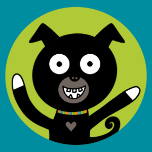

 

# Yatzy Coach

Yatzy Coach is an iOS app for the [American rules](https://en.wikipedia.org/wiki/Yahtzee) of the game of [Yatzy](https://en.wikipedia.org/wiki/Yatzy). The app lets you lets you play a solo game while it provides feedback on your moves. You also have the option of displaying a detailed analysis of all available moves.

### Installation

The app can be downloaded for free from the Apple [App Store](https://apps.apple.com/us/app/id6575389687/). There are no in-app purchases or ads.

### Privacy

This app does not collect or share any personal information. For complete details, read the [Privacy Policy](https://stephenbensley.github.io/YatzyCoach/privacy.html)

### License

The source code for this app has been released under the [MIT License](LICENSE).

### Copyright

© 2024 Stephen E. Bensley

## Building from Source

The app was developed with [Xcode](https://developer.apple.com/xcode/), which is freely available from Apple. After installing Xcode and cloning the repo, open the Xcode [project](YatzyCoach.xcodeproj) at the root of the repo. The Git tags correspond to App Store releases. Checkout the most recent tag to ensure a stable build.

### Dependencies

The app depends on one Swift Packages (developed by me): [UtiliKit](https://github.com/stephenbensley/UtiliKit). This should be resolved automatically when you open and build the project.

### Targets

The Xcode project has the following targets:

- CoreTests: Unit tests for the core game logic.
- YatzyCoach: The iOS app.
- YatzySolver: A MacOS app that solves the game. Make sure you build the Release configuration; Debug will be very slow.
